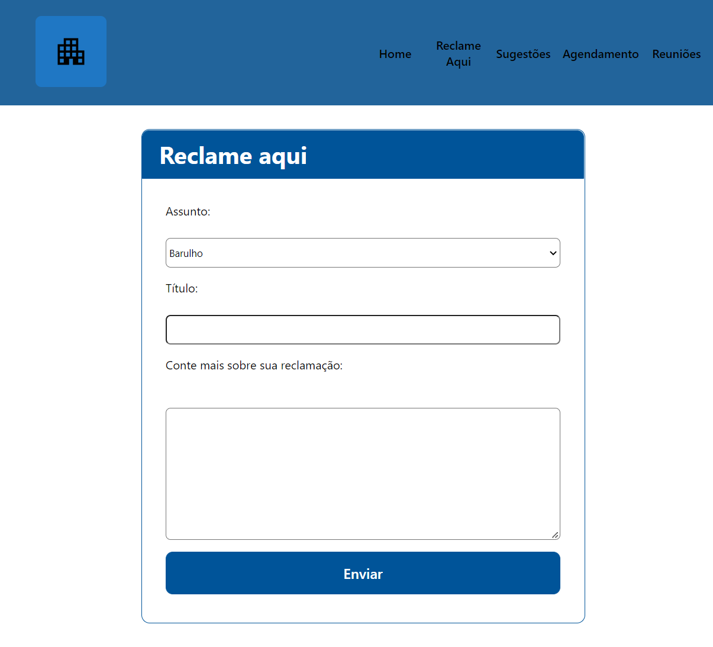

# Programação de Funcionalidades

Nesta seção são apresentadas as telas desenvolvidas para cada uma das funcionalidades do sistema com a atribuição dos requisitos atendidos.

- **Tela de Login**

Tela que permite o usuário realizar o login ou o registro na aplicação.

<u>**Requisitos atendidos**</u>

<li>RF-xx - O sistema deve cadastrar usuários.</li>
<li>RF-xx - O sistema deve solicitar o e-mail e a senha do usuario para acesso a aplicação.</li>

<u>**Artefatos da funcionalidade**</u>

- Tela Login.html
- stylem.css
- scriptcadastro.js

- **Tela de Cadastro**

Tela que permite ao usuário realizar o registro na aplicação, o usuário devera fornecer um e-mail e senha.
Tela que permite ao usuário acesse o termo de uso da aplicação.

<u>**Requisitos atendidos**</u>

<li>RF-xx - O sistema deve cadastrar usuários.</li>
<li>RF-xx - O sistema deve solicitar o e-mail e a senha do usuários para acesso.</li>

<u>**Artefatos da funcionalidade**</u>

- Tela Login.html
- stylem.css
- scriptcadastro.js

- **Tela de Home  (RF–xx, RF–xx)**

Tela que permite o usuário navegar pelos menus das paginas. 
Tela que permite o usuário visualiza os informativos do condomínio.

<u>**Requisitos atendidos**</u>

<li>RF-xx - O sistema deve cadastrar usuários.</li>
<li>RF-xx - O sistema deve solicitar o e-mail e a senha do usuário para acesso..</li>

Pré-requisitos: <a href="2-Especificação do Projeto.md"> Especificação do Projeto</a>, <a href="3-Projeto de Interface.md"> Projeto de Interface</a>, <a href="4-Metodologia.md"> Metodologia</a>, <a href="3-Projeto de Interface.md"> Projeto de Interface</a>, <a href="5-Arquitetura da Solução.md"> Arquitetura da Solução</a>

Nesta seção são apresentadas as telas desenvolvidas para cada uma das funcionalidades do sistema. O respectivo endereço (URL) e outras orientações de acesso não são apresentadas na sequência.

<h3> Tela de Financeiro </h3>

Tela que permite ao condômino ter acesso aos boletos, podendo realizar o pagamento do mesmo, após baixa-lo e adquirir o código de barras. Também é possivel visualizar a situação dos pagamentos dos boletos, podendo estar: Em aberto, Pago, Em atraso ou Indisponível.

<b> Requisitos Atendidos </b>

RF-05 - O Sistema deve apresentar uma opção para finanças, onde o condomínio conseguirá realizar pagamentos de taxas, solicitação de boletos, datas dos próximos boletos, inadimplências e entre outros.

<b> Artefatos da funcionalidade </b>

index.html  
styles.css  
assets/boleto.png  
assets/download-da-nuvem.png   
assets/predio-comercial.png

<b><h3> Estrutura de Dados </b></h3>  

<b> <h3> Instruções de acesso </b> </h3>

Faça o download do arquivo do projeto (ZIP) ou clone do projeto no GitHub; 
Descompacte o arquivo em uma pasta específica; 
Abra o Visual Studio Code e execute o Live Server;

## Reclamações (RF-5)

A tela que permite ao usuário registrar uma reclamação relacionada ao condomínio.

### Requisitos atendidos
- RF-05

### Artefatos da funcionalidade
- pgReclameAqui.html
- script_pesquisa.js
- style.css
- apartament_logo.svg
- icon-menu.png

  
